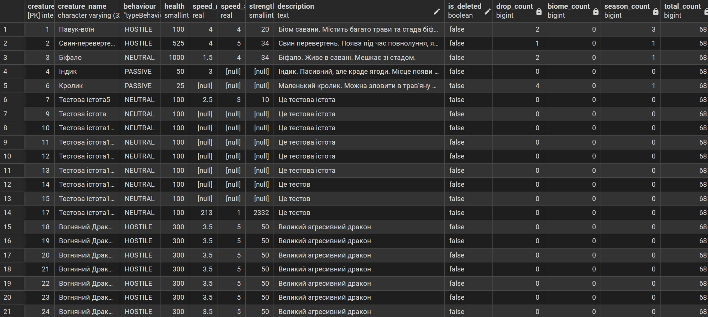

## Звіт: Аналітичні SQL-запити для ігрової платформи
---
# Запит 1: Активні істоти та статистика зв’язків

Бізнес-питання:
Потрібно отримати всі активні істоти на платформі разом із кількістю їхніх дропів (предметів), біомів та сезонів, а також загальну кількість активних істот. Це дозволяє швидко оцінити, скільки ресурсів та контенту пов’язано з кожною істотою.

**SQL-запит**:
```
SELECT 
    c.creature_id,
    c.creature_name,
    c.behaviour,
    c.health,
    c.speed_move,
    c.speed_attack,
    c.strength_attack,
    c.description,
    c.is_deleted,
    
    COUNT(DISTINCT cd.item_id) AS drop_count,
    COUNT(DISTINCT cb.biome_id) AS biome_count,
    COUNT(DISTINCT cfs.season_id) AS season_count,
    
    total.total_count
FROM creature c
LEFT JOIN "creatureDrop" cd ON cd.creature_id = c.creature_id
LEFT JOIN "creatureBiome" cb ON cb.creature_id = c.creature_id
LEFT JOIN "creatureForSeason" cfs ON cfs.creature_id = c.creature_id
CROSS JOIN (
    SELECT COUNT(*) AS total_count
    FROM creature
    WHERE is_deleted = FALSE
) AS total
WHERE c.is_deleted = FALSE
GROUP BY c.creature_id, total.total_count
ORDER BY c.creature_id ASC;
```

**Пояснення:**

    **JOIN**:

        LEFT JOIN creatureDrop cd: отримуємо предмети, які падають з істоти.

        LEFT JOIN creatureBiome cb: отримуємо біоми, де мешкає істота.

        LEFT JOIN creatureForSeason cfs: отримуємо сезони, в яких з’являється істота.

        CROSS JOIN: підзапит, який повертає загальну кількість активних істот (total_count) для всіх рядків.

    **WHERE**:

        c.is_deleted = FALSE — фільтруємо тільки активні істоти.

    **GROUP BY**:

        Групуємо результати по creature_id для підрахунку унікальних зв’язків.

    **AGGREGATION**:

        COUNT(DISTINCT cd.item_id) — кількість унікальних предметів, які падають з істоти.

        COUNT(DISTINCT cb.biome_id) — кількість унікальних біомів для істоти.

        COUNT(DISTINCT cfs.season_id) — кількість сезонів, в яких активна істота.

    **ORDER BY**:

        Сортуємо по creature_id за зростанням для впорядкування результатів.

**Результат:**

---
# Запит 2: Деталі предмета та статистика зв’язків

Бізнес-питання:
Потрібно отримати конкретний предмет за item_id разом із кількістю біомів, істот, стартових предметів персонажів та типів, до яких він належить. Це допомагає оцінити “важливість” предмета в грі та перевірити, де він використовується.

**SQL-запит з JOIN:**
```
SELECT 
    i.*,
    COUNT(DISTINCT iib.biome_id) AS biome_count,
    COUNT(DISTINCT cd.creature_id) AS creature_count,
    COUNT(DISTINCT si.character_id) AS start_item_count,
    COUNT(DISTINCT itit.item_type_id) AS type_count
FROM item i
LEFT JOIN "itemsInBiome" iib ON iib.item_id = i.item_id
LEFT JOIN "creatureDrop" cd ON cd.item_id = i.item_id
LEFT JOIN "startItem" si ON si.item_id = i.item_id
LEFT JOIN "itemToItemType" itit ON itit.item_id = i.item_id
WHERE i.item_id = 3
GROUP BY i.item_id;
```
**Пояснення:**

**FROM** item i:
    Беремо головну таблицю item для конкретного item_id.

**LEFT JOIN**:

    itemsInBiome iib — біоми, в яких присутній предмет.

    creatureDrop cd — істоти, з яких випадає предмет.

    startItem si — стартові предмети персонажів, що містять цей предмет.

    itemToItemType itit — типи, до яких належить предмет.

**WHERE:**

    Фільтруємо лише предмет із заданим item_id.

**COUNT(DISTINCT …):**

    Рахуємо унікальні записи у кожній таблиці для підрахунку кількості зв’язків.

**GROUP BY i.item_id:**

    Необхідно, бо ми використовуємо агрегатні функції (COUNT) разом із деталями предмета.

**Результат:**
